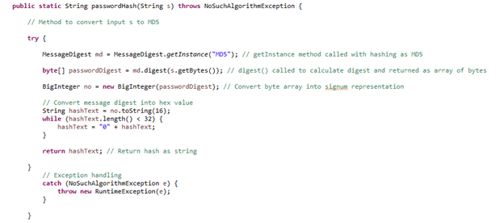

# Hello, and welcome to my ePortfolio.

My name is Kevin Seng. This ePortfolio will outline my process of converting an older project for a zoo authentication system and the enhancements that follow. 

This will include the following:

- Professional Self-Assessment
- Initial code review with incoming enhancements
- Artifacts and Enhancements:
    - Software Design and Engineering: Update of GUI
    - Algorithm and Data Structures: Authenticating Users Through MD5 With Database
    - Database: Implementation of PostgreSQL database
- Narritive of each enhancement

## Profesional Self-Assessment

This ePortfolio was created as part of my Computer Science capstone at Southern New Hampshire University. 

Prior to this capstone I did not have much experience with any of the elements included with the enhancements. The Computer Science program at Southern New Hampshire University has provided me with the tools and confidence to tackle the enhancements that I have chosen to implement. With this confidence I was happy to take on these new challenges and become acquainted with the new technologies such as implementing a GUI by way of JFrames, authentication of user credentials against MD5 hashes available from my database, and implementing a PostgreSQL database to read from. These enhancements come together to create a more cohesive application that an end user would be more comfortable using, rather than interacting through a console.

As demonstrated through this ePortfolio, the application was morphed from one that made use of console input/output and credentials saved to a text file to one that is more aesthetically appealing and makes use of a database to more securely store user credentials and information. 

Throughout my career at Southern New Hampshire University I have had the opportunity hone my skills to further myself as a developer. I have been able to collaborate on fulfilling projects such as a jukebox application between an entire class, learned new technologies in respect to data structures and algorithms, implement my own databases, and obtained techniques to be able to successfully test my own as well as others' applications to ensure quality.

## Initial Code Review and Incoming Enhancements

<iframe width="560" height="315" src="https://www.youtube.com/embed/GF4T9qjylZo" frameborder="0" allow="accelerometer; autoplay; clipboard-write; encrypted-media; gyroscope; picture-in-picture" allowfullscreen></iframe>

## Artifacts and Enhancements:

#### Software Design and Engineering: Update of GUI

The first enhancement as a part of my ePortfolio is to update the interface that the user will encounter. Originally, this interface took the form of text in the console view. This was the first enhancement that came to mind as I believed that the console did not provide adequate value and needed an overhaul. In implementing the enhancement I first had trouble with formatting and obtaining the look that I was aiming for with my JFrame. Thanks to finding JPanels I was able to create a GUI that I was happy with. An example of this can be found below: 

My plan to implement the new GUI would be to make use of JFrame. This would be done in two pieces, the main frame and the panel. This was done purely for aesthetics of the window. First I will create a main frame to house a header which would display the “Zoo Authentication System” message. Secondly, I have a status area that will display information regarding the login attempt and subsequently print role information upon successful login. The final area will be a panel that houses the username and password fields as well as buttons for user to interact with. The code below is to create the main frame:

The code begins with setting the JFrame. The header and status are created as labels, while the panel is created as a JPanel. This allowed the username and password fields as well as the buttons to be local to the panel instead of taking up real estate on the rest of the window. Once these objects were created, they are then added to the frame. The code for the panel can be found below:

Similar to the main frame, createPanel() starts with creating the panel and settings size and layout. Once that has completed, the labels and buttons are created. The buttons make use of action listeners to run code once they are clicked. These are then added to the panel and subsequently added to the main frame through the controlPanel JPanel. 
The prepareGUI() and createPanel(); methods are called from the default constructor and main method respectively. A new AuthenticationSystem, authenticationSystem, is created and then calls createPanel from main. The calls can be found here:

This results in the following GUI:
 

#### Algorithm and Data Structures: Authenticating Users Through MD5 With Database

My second enhancement as a part of my ePortfolio is to update the algorithms for checking the username and password. While the process will remain relatively the same, the difference will be that the code will not longer reference a file and be done through console, but will implement the use of a database as well as trigger through a GUI rather than entering values through console. Initially, I struggled with figuring out how I wanted to implement the check against credentials as I knew I wanted to check against the database. I got through this by hardcoding credentials for testing until the database had been created and populated. This later served as a means to troubleshoot the code and ensure that the matches to the MD5 were working correctly. I had also run into a number of bugs with the actionListener triggering the method and had some issues debugging, but ultimately found that exceptions were not being handled correctly and throwing errors.

The old version of the code made use of a scanner and file input stream to read the user input as well as read the credentials file:

This input would then be converted into a MD5 hash:

The newer version of the code retrieves the input from the JTextFields and the hashing function has been placed into methods for the username and password respectively:

Once the actionListener is triggered by use of the ‘enter’ button, these methods will be called and check that the user inputted credentials match the current hard coded credentials. If there is a match, the statusLabel JLabel will be updated to reflect the match, else it will advise that the username and/or password do not match. There is also a catch for the NoSuchAlgorithmException. The commented code was for testing purposes to ensure that the hashes were equal for the password before continuing with the rest of the code. 

The application will then read credentials from the database and check hashes against the database. The statusLabel will also update with the role information that is stored in the database. 

Matching username/password:

Invalid username/password:

#### Database: Implementation of PostgreSQL database

My third enhancement as a part of my ePortfolio is to implement a database that will store the credentials for users to verify against. Before working through this capstone, I had never connected a PostgreSQL database to an application. This itself posed a challenge to me. In this enhancement I would create the database, host it on my machine, and create the connections between the application and database. I believed this would be the right path as it would be more secure to the initial method. Prior to the database, the application read from a credentials text file to verify the users’ username, hash, password, and role. This has all been updated to be stored in a PostgreSQL database. 

The old text file:

The newly created table in the database:

The old version of the application make use of a FileInputStream to read from the file and print either the role upon successful login or error if incorrect or too many attempts:

This has been updated in the new application as a connection to the database and makes use of a select statement to search by username and return the corresponding hashed password and role. This is then checked against the has of what was inputted by the user. It then prints the role to the statusLabel. The code is:

The application is able to read from the database successfully and check against the user and password hashes to verify the user and print the corresponding role:

